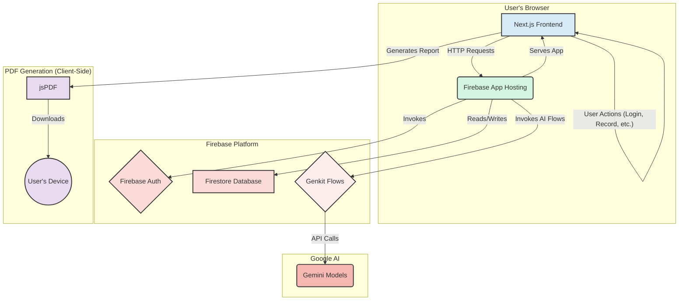

# CogniScreen System Architecture

This document outlines the system architecture for the CogniScreen application, a web-based tool for early dementia detection.

## Architecture Components

### 1. Frontend (Client-Side)

*   **Technology**: Next.js, React, TypeScript, ShadCN UI, Tailwind CSS.
*   **Responsibilities**:
    *   Renders the user interface for all pages (Landing, Login, Dashboard, etc.).
    *   Manages client-side state for interactive components like the memory game and audio recorder.
    *   Handles user input and triggers server actions.
    *   Communicates with Firebase Authentication for user login/signup.
    *   Generates the final PDF report directly in the browser using `jsPDF`.

### 2. Web Server & Hosting

*   **Technology**: Firebase App Hosting, Next.js Server (App Router).
*   **Responsibilities**:
    *   Hosts and serves the Next.js application to the user.
    *   Executes Next.js Server Actions, which contain the logic to call backend services.
    *   Provides the secure environment where server-side logic runs.

### 3. Backend Services (Firebase)

*   **Technology**: Firebase Authentication, Firestore.
*   **Responsibilities**:
    *   **Firebase Authentication**: Securely manages user accounts, including creation, login, and session management.
    *   **Firestore**: A NoSQL database used to store user profile information (e.g., name, email).

### 4. AI/ML Layer

*   **Technology**: Genkit, Google AI (Gemini Models).
*   **Responsibilities**:
    *   **Genkit**: Acts as an orchestrator for AI-powered tasks. It defines the prompts and data schemas for interacting with the AI models. The application code calls these Genkit "flows".
    *   **Gemini Models**: The underlying Large Language Models that perform the core intelligent tasks:
        *   Analyzing speech transcripts and audio for signs of cognitive decline.
        *   Evaluating the results of the memory task.
        *   Synthesizing all data points to generate a comprehensive dementia risk score and recommendations.

## Data Flow Example: Generating a Risk Score

1.  The user completes the **Speech Analysis** and **Cognitive Task** on the **Next.js Frontend**.
2.  The results from these tasks are sent from the client to a **Next.js Server Action** running on the **Firebase App Hosting** server.
3.  The Server Action invokes the `generateDementiaRiskScore` **Genkit Flow**.
4.  The Genkit flow constructs a prompt with the user's data and sends it to the **Gemini Model** via the Google AI API.
5.  The Gemini Model processes the information and returns a structured JSON object containing the risk score, risk factors, and recommendations.
6.  Genkit parses the response and returns it to the Server Action.
7.  The Server Action sends the result back to the client.
8.  The **Next.js Frontend** updates the UI to display the new risk score and associated details to the user.
